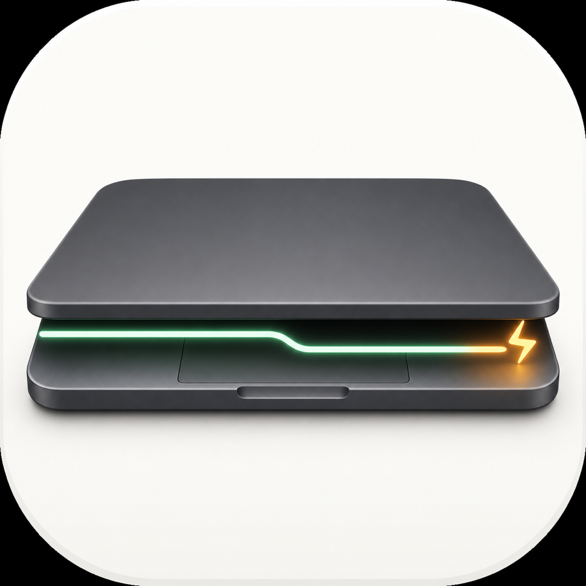
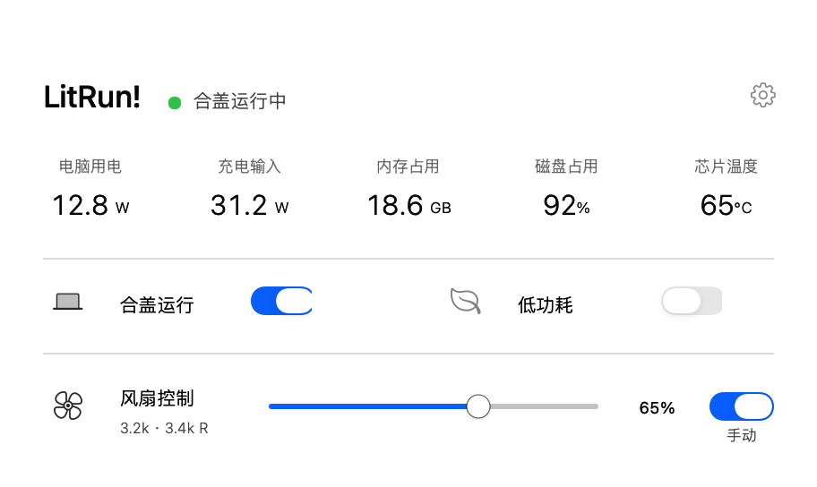
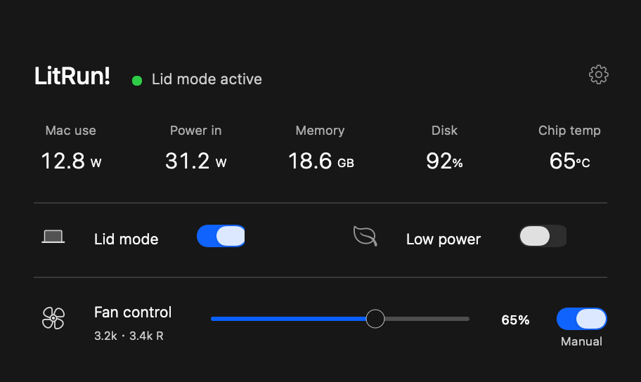
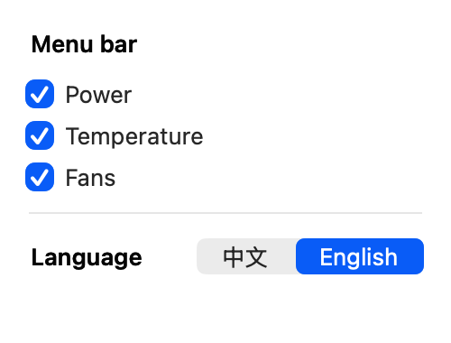

<p align="center">
  
</p>

<h1 align="center">不熄！ / LitRun!</h1>

<p align="center">
  一个极简的 macOS 菜单栏工具，让任务按需合盖续跑，并以自适应慢速调度降低后台负载。
</p>

<p align="center">
  <a href="https://github.com/orangcmusic/litrun/releases/tag/v3.0.0"></a>
  <a href="https://github.com/orangcmusic/litrun/actions/workflows/ci.yml"></a>
  <a href="LICENSE"></a>
</p>

<p align="center">
  
  
</p>

## 这是什么

LitRun! 是一个原生 AppKit 菜单栏工具，面向需要让代码、自动化或长任务继续运行的 Mac 用户。它把合盖运行、低功耗和风扇控制拆成三个独立能力，并保留可恢复的系统状态。

它不是硬件级功耗上限，也不能让密闭包内的高负载工作变得安全。合盖放入包内前，应先确认任务已经降到轻负载，并观察真实温度与功耗。

## 核心能力

| 能力 | 行为 |
| --- | --- |
| 合盖运行 | 合盖后保持任务和网络连接，不自动启用低功耗慢跑。 |
| 低功耗 | 按功耗、温度和热状态自适应降低明显后台负载，开盖或合盖都可独立使用。 |
| 风扇控制 | 只在只读探测确认固件支持后开放，用一个滑条调节可控风扇；不支持的机型自动禁用。 |
| 实时遥测 | 显示电脑用电、充电输入、内存、磁盘、芯片温度、风扇转速和网速。 |
| 异常恢复 | 电源、亮度、风扇和被暂停任务都有独立恢复记录与守护。 |
| 双语界面 | 首次启动选择中文或 English，之后可以在齿轮设置中即时切换。 |

低功耗只处理明显高负载的后台任务，并保护当前前台 App、它的子进程和同一 App 包内的辅助进程。它尽量降低后台负载，但不是硬件功耗锁。

## 下载和安装

前往 [v3.0.0 Release](https://github.com/orangcmusic/litrun/releases/tag/v3.0.0)，推荐下载拖拽式 DMG：

1. 打开 `LitRun-v3.0.0-macOS13-universal.dmg`。
2. 将 `LitRun!.app` 拖到旁边的 `Applications` 图标。
3. 从“应用程序”或菜单栏启动 LitRun!。

ZIP 适合需要手动解压或自动化部署的测试者。两种包都包含原生 `arm64` 与 `x86_64`，支持 macOS 13 或更高版本。

首次启动会选择语言；首次使用受限的电源或风扇功能时，macOS 可能要求一次管理员授权。红色关闭按钮只隐藏窗口，菜单栏和任务会继续运行；使用菜单栏“退出软件”才会结束 App 并恢复状态。

> 当前公开包采用 ad-hoc 签名，尚未进行 Developer ID 公证。首次打开可能需要在“系统设置 → 隐私与安全性”中确认，仅适合技术测试者。

## 界面预览



窗口提供五项主要读数：电脑用电、充电输入、内存占用、磁盘占用和芯片温度。菜单栏可以在齿轮设置中独立选择六项指标；选择为空时隐藏状态栏指标，但仍可从窗口恢复。

五项指标使用纵向 `3+2` 布局，六项使用对称的 `3+3` 布局。网速只读取活动物理网卡的收发字节计数，不记录网络内容，也不会启动周期性外部命令。

## 兼容性

| Mac 类型 | 低功耗 | 合盖运行 | 风扇控制 |
| --- | --- | --- | --- |
| 有可控风扇的 Apple 芯片 MacBook | 支持 | 支持 | 只读探测后启用 |
| 无风扇 MacBook Air | 支持 | 支持 | 自动禁用 |
| Intel MacBook | 逻辑和 Rosetta 路径已检查 | 需要真机确认 | 需要真机确认 |
| Mac mini、iMac、Mac Studio、Mac Pro | 支持 | 无电脑盖时禁用 | 取决于硬件 |

完整边界见[兼容性说明](docs/COMPATIBILITY.md)。当前仍需在真实 Intel、无风扇 Apple Silicon、桌面 Mac 和外接/较窄菜单栏上补充硬件验证。

## 安全边界

- 合盖放入密闭包内运行高负载任务不安全；包会阻挡进风和散热。
- 低于 50% 的手动风扇设置会先警告，0% 会要求停止可控风扇。
- 芯片达到 99°C、macOS 热状态升高、App 异常退出或恢复失败时，会回到自动温控。
- 无法可靠读取功耗、充电输入或温度时，界面显示不可用，不估造数值。
- 低功耗会保留短暂运行窗口，保证任务继续推进，不承诺每个第三方程序都完全不受影响。

## 从源码构建

需要一台 macOS 13+ 和 Xcode Command Line Tools：

```bash
./scripts/build.sh
./scripts/test.sh
./scripts/package_release.sh
```

在 Intel Mac 原生运行，或在 Apple 芯片 Mac 上通过 Rosetta 执行独立的 x86_64 检查：

```bash
./scripts/test_x86_64.sh
```

构建脚本生成 Universal App、ZIP、DMG 和校验文件。`build/` 与 `dist/` 是本地生成目录，不进入源码提交。

## 参与开发

欢迎提交问题、改进建议和 Pull Request。请先阅读[贡献指南](CONTRIBUTING.md)和[路线图](ROADMAP.md)。

- [提交 Bug](https://github.com/orangcmusic/litrun/issues/new?template=bug_report.md)
- [提出功能建议](https://github.com/orangcmusic/litrun/issues/new?template=feature_request.md)
- [查看现有 Issues](https://github.com/orangcmusic/litrun/issues)
- [查看项目 Release](https://github.com/orangcmusic/litrun/releases)

请不要在 Issue 或 Pull Request 中上传密码、Token、私有日志、邮箱验证码或完整的系统隐私报告。

## 项目文档

[架构](docs/ARCHITECTURE.md) · [兼容性](docs/COMPATIBILITY.md) · [隐私](PRIVACY.md) · [安全](SECURITY.md) · [第三方声明](THIRD_PARTY_NOTICES.md) · [发布检查](docs/RELEASE_CHECKLIST.md) · [朋友测试指南](docs/FRIEND_TEST_GUIDE.zh-CN.txt)

LitRun! 不联网、不上传遥测、不保存任务内容。

## 许可证

[MIT License](LICENSE)
